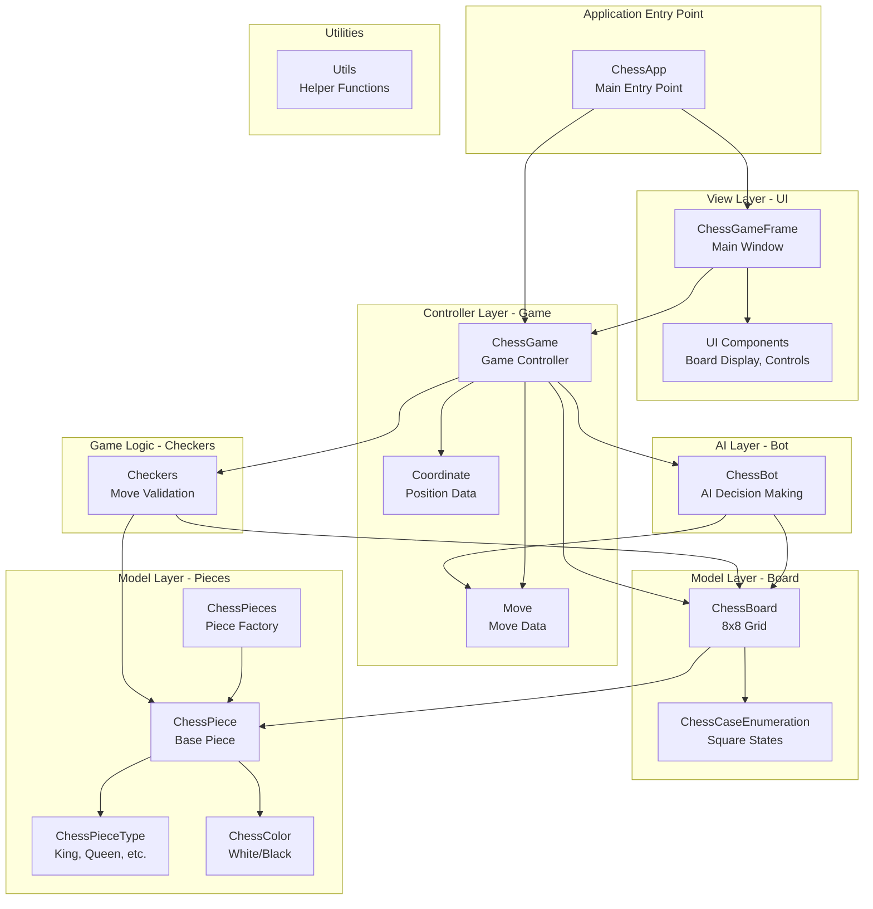

# Chess Bot Architecture

This diagram shows the internal architecture of the Chess Bot desktop application.

## Architecture Overview

The Chess Bot is a Java-based desktop application that provides a graphical chess game with AI opponent capabilities. The application follows a layered architecture pattern:

1. **Model Layer**: Contains the core game logic including chess pieces, board representation, and game rules
2. **View Layer**: Swing-based GUI components for user interaction
3. **Controller Layer**: Manages user input and coordinates between model and view
4. **AI Layer**: Implements bot decision-making for computer opponent moves

## Component Diagram

## Data Flow

1. **User Input**: User interacts with the Swing GUI (ChessGameFrame)
2. **Event Handling**: UI events are captured and passed to ChessGame controller
3. **Move Validation**: Checkers validate if the move is legal
4. **Model Update**: ChessBoard and ChessPiece objects are updated
5. **Bot Turn**: ChessBot evaluates board state and selects a move
6. **View Update**: GUI refreshes to display the new board position

## Key Components

- **ChessApp**: Application entry point that initializes the game
- **ChessGame**: Central controller managing game state and flow
- **ChessBoard**: 8x8 grid representation (A1 at [0][0], H8 at [7][7])
- **ChessPiece**: Base class for all chess pieces (King, Queen, Rook, Bishop, Knight, Pawn)
- **ChessBot**: AI implementation for computer opponent
- **Checkers**: Move validation and game rules enforcement

## Notes

- To view this diagram, install a Mermaid preview extension in VS Code
- The application uses Java Swing for the graphical interface
- Board coordinates: A1 = [0][0] (bottom-left), H8 = [7][7] (top-right)
